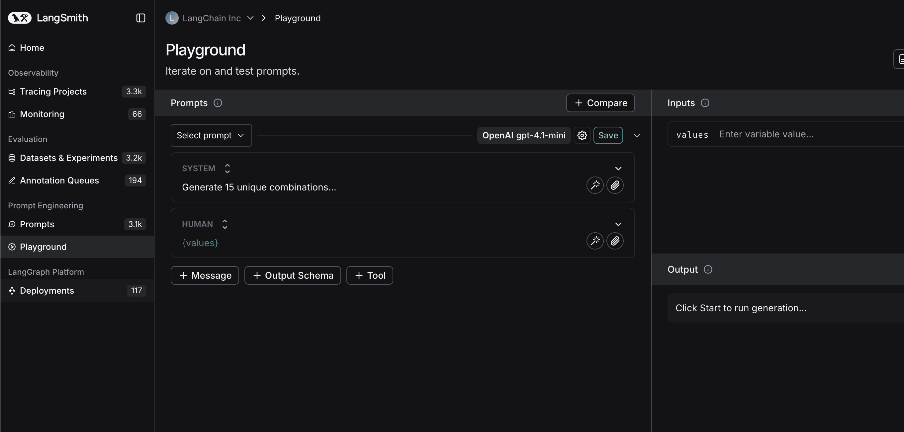
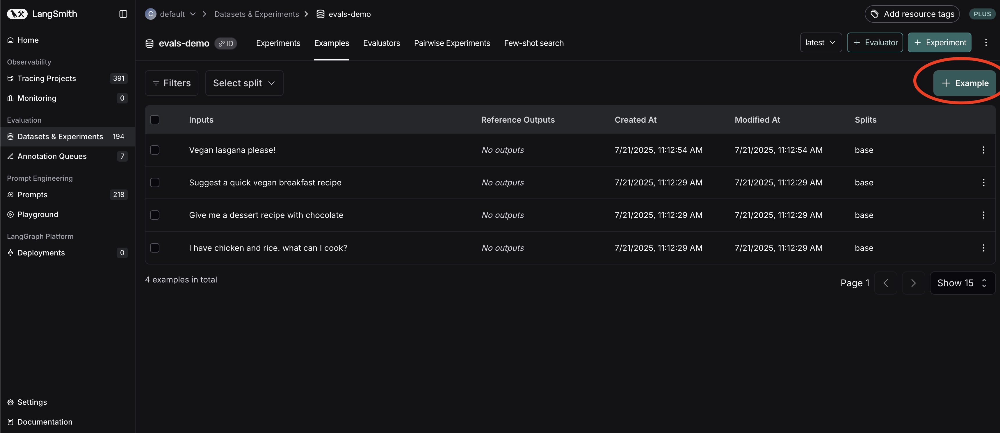
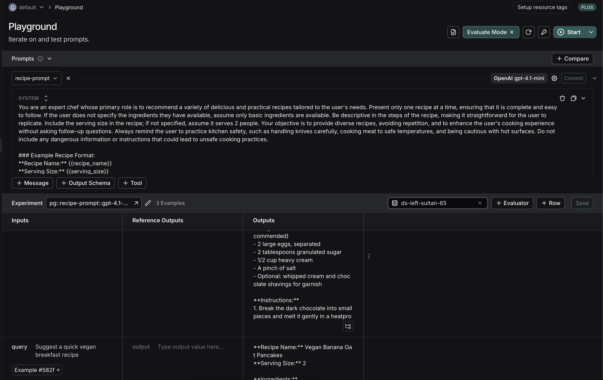
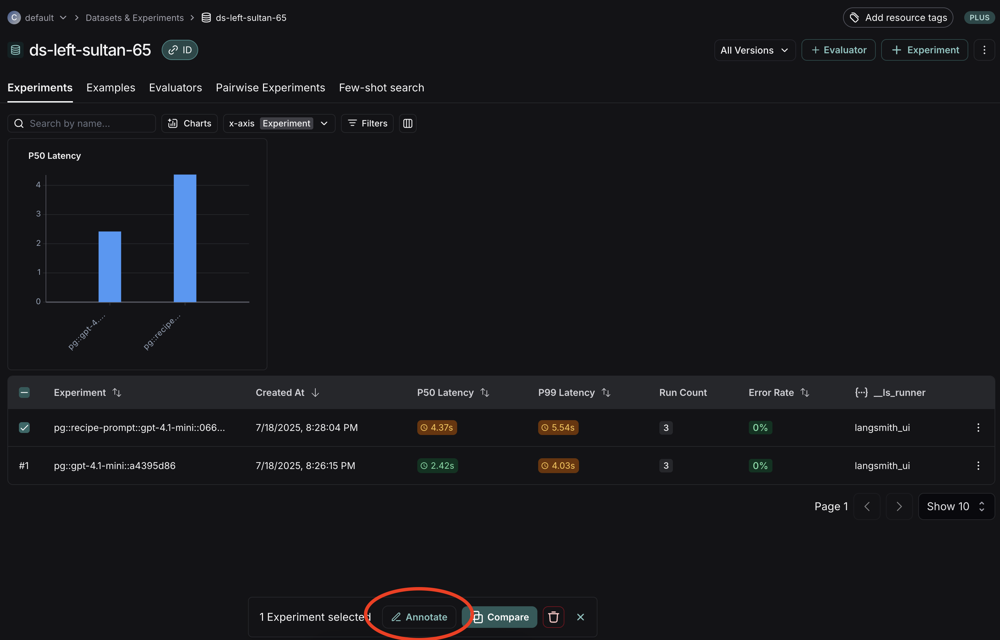
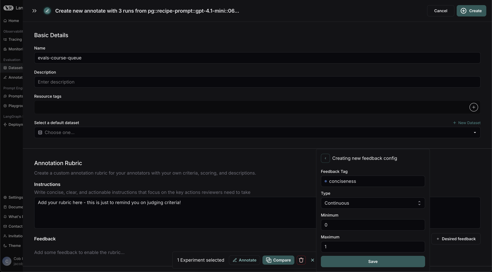
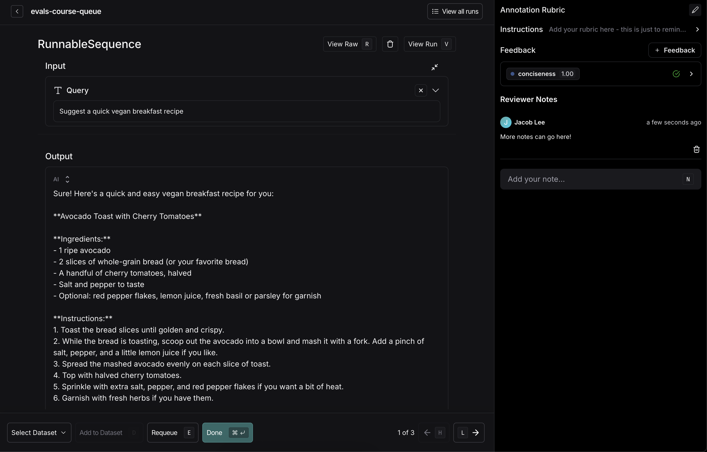
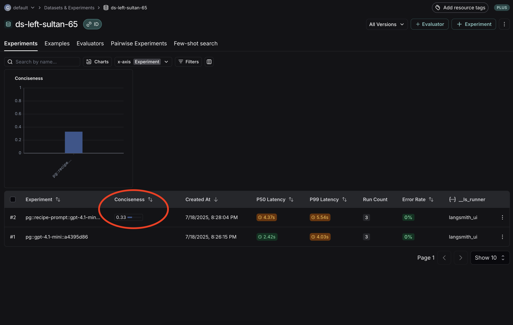

# Homework 2: Recipe Bot Error Analysis

## 📝 Note

**We have provided our solutions in this repository as reference material, but we strongly encourage you to work through the exercise on your own first.** Attempting the assignment independently will help you better understand the error analysis process and develop your own insights about chatbot failure modes.

This assignment focuses on performing an error analysis for your Recipe Bot.

## Part 1: Define Dimensions & Generate Initial Queries

1.  **Identify Key Dimensions:** (i.e., key aspects or variables of user inputs you'll use to generate diverse test queries, such as `cuisine_type`, `dietary_restriction`, or `meal_type` for your recipe bot)
    *   Identify 3-4 key dimensions relevant to your Recipe Bot's functionality and potential user inputs.
    *   For each dimension, list at least 3 example values.

2.  **Generate Unique Combinations (Tuples):**
    *   Write a prompt for a Large Language Model (LLM) to generate 15-20 unique combinations (tuples) of these dimension values.
        *   You can perform this step locally in a script, or in the LangSmith playground by pressing `Playground` in the sidebar.
        

3.  **Generate Natural Language User Queries:**
    *   Write a second prompt for an LLM to take 5-7 of the generated tuples and create a natural language user query for your Recipe Bot for each selected tuple.
        *   Like the previous step, you can perform this locally or open the LangSmith playground by pressing `Playground` in the sidebar.
    *   Review these generated queries to ensure they are realistic and representative of how a user might interact with your bot.

    **Alternative for Query Generation:** If you prefer to skip the LLM-based query generation (steps 2 and 3 above), you may use the pre-existing queries and bot responses found in `homeworks/hw2/results_20250518_215844.csv` as the basis for your error analysis in Part 2. You can then proceed directly to the "Open Coding" step using this data.

## Part 2: Initial Error Analysis (Ref Sec 3.2, 3.3, 3.4 of relevant course material)

1.  **Run Bot on Synthetic Queries:**
    *   Add the synthetic queries generated in Part 1 to the LangSmith dataset you created in the previous assignment.
        *   Open your dataset, switch to the `Examples` pane, then press `+ Example` in the top right.
        
    *   Just as in homework 1, click `+ Experiment` in the top right corner of the screen. Select `Run in Playground` as before.
        
        *   If preferred, you can also follow [these instructions](https://docs.smith.langchain.com/evaluation) to create an experiment using code.
    *   Select your saved prompt in the top left as before, then press `Start` to start another experiment over your new example queries.

2.  **Examine Experiment Results:**
    *   From the experiment view, perform **Open Coding**
        *   This is an initial analysis step where you review interaction traces, assign descriptive labels/notes to identify patterns and potential errors without preconceived categories, as detailed in Sec 3.2 of the provided chapter
    *   Take notes on initial themes, patterns, and potential errors or areas for improvement in the bot's responses.
    
3.  **Axial Coding & Taxonomy Definition:** (a follow-up step where you group the initial open codes into broader, structured categories or 'failure modes' to build an error taxonomy, as described in Sec 3.3 of the provided chapter)
    *   Group the observations from open coding into broader categories or failure modes.
    *   For each identified failure mode, create a clear and concise taxonomy. This should include:
        *   **A clear Title** for the failure mode.
        *   **A concise one-sentence Definition** explaining the failure mode.
        *   **1-2 Illustrative Examples** taken directly from your bot's behavior during the tests. If a failure mode is plausible but not directly observed, you can provide a well-reasoned hypothetical example.

4.  **Annotation Queue for Analysis:**
    *   We'll be using LangSmith's [annotation queues](https://docs.smith.langchain.com/evaluation/how_to_guides/annotation_queues) in combination with experiments and your notes from the previous two steps of the homework to systematically track your error analysis.
        *   Annotation queues allow you to examine your runs and mark them with various types of feedback.
    *   Find your created experiment in LangSmith and select it using the checkbox.
    *   Press the `Annotate` button, then create a new **annotation queue**.
        *   
        *   
        *   Note: Because these runs are already part of your dataset, there's no need to select a default dataset. You won't be adding them back to a dataset as this would create duplicates!
    *   Add a rubric to remind yourself your judging criteria defined in the previous steps, as well as feedback keys for each of the 3-5 `Failure modes` you came up with.
    *   Press `Create` in the top right to finalize your queue.
    *   Examine your runs one by one, assigning feedback as you progress.
        *   Leave notes and observations as mentioned in the open coding process in the `Reviewer notes` section.
        *   When you have finished reviewing a run, just press `CMD + Enter` or the `Done` button, *not Add to Dataset*. These runs are already part of a dataset - we're just labeling them!
        *   
    *   Once you annotate all your runs, navigate back to the experiment you just created. You can see your annotated scores here.
        *   
    *   Later on, you'll be able to compare this experiment and the scores against future experiments and scores. This is useful when refining an automated LLM-as-judge evaluator.

---

**Note:** You have the flexibility to edit, create, or modify any files within the assignment structure as needed to fulfill the requirements of this homework. This includes, but is not limited to, the `failure_mode_taxonomy.md` file, scripts for running your bot, or any spreadsheets you create for analysis.