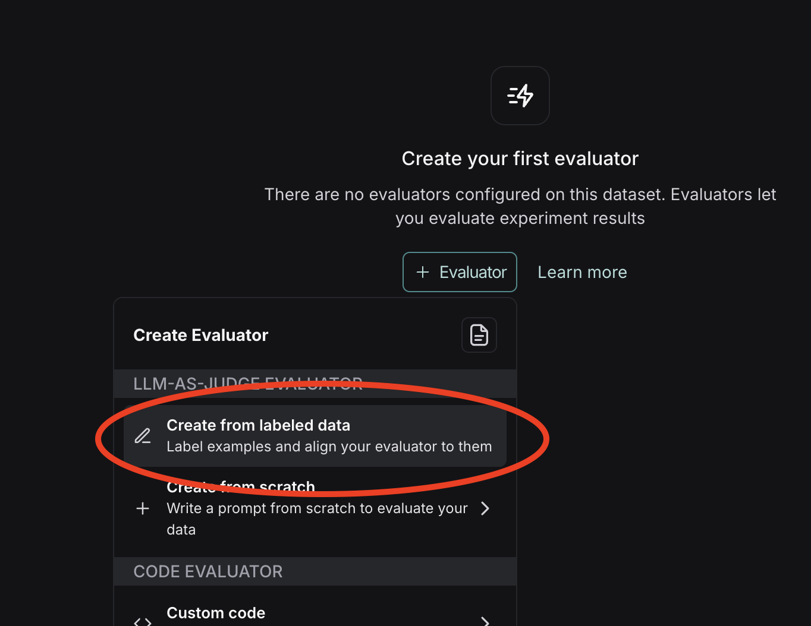
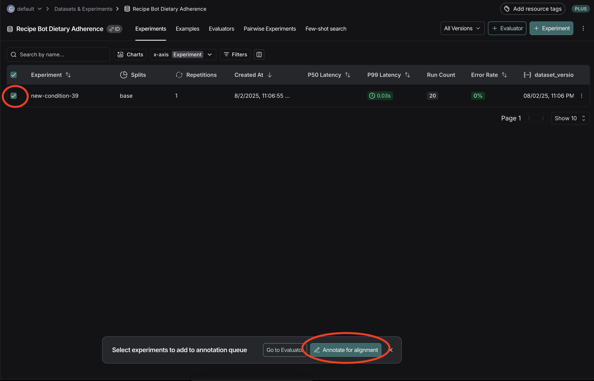
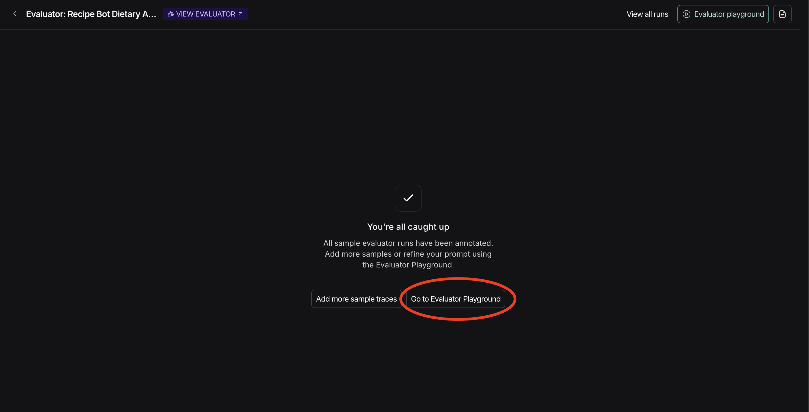

# Homework 3: LLM-as-Judge for Recipe Bot Evaluation

## Your Core Task: Evaluate "Adherence to Dietary Preferences" for the Recipe Bot

**Example**: If a user asks for a "vegan" recipe, does the bot provide one that is actually vegan?

We'll provide starter Recipe Bot traces and detailed criteria for this failure mode if you want a head start! We picked this criterion because it's fairly easy to align an LLM judge on dietary restrictions - the rules are generally clear and objective.

**Alternatively**, you can choose a different Recipe Bot failure mode you identified in HW2/Chapter 3, but you'll need to define criteria and generate/source all your own traces.
Note that we've added a new `dietary_restriction` parameter that is now part of the trace!

## Tools You'll Use
- Your preferred LLM (for crafting the judge)
- Your critical thinking & prompt engineering skills!
- LangSmith's dataset, experiment, and [align evals](https://docs.smith.langchain.com/evaluation/tutorials/aligning_evaluator) features.

By the end of the homework, you'll have an LLM-as-Judge prompt that you've aligned with your own human judgement. You can use this to evaluate future outputs from your app.

## Assignment Steps: From Labels to Confident Measurement 📊

### Step 1: Set up your data
Since the previous homeworks covered trace generation and labeling, this homework provides a `sampled_labeled_traces.csv` dataset of 20 pre-labeled examples. However, if you want to choose a different failure mode, you'll need to come up with some sample queries and dietary restrictions and [run an experiment](https://docs.smith.langchain.com/evaluation).

Make sure you've set the [required environment variables](../../README.md#environment-variables), then run the provided `create_langsmith_experiment.py` script to create a new dataset and a new experiment from these pre-labeled examples:

```bash
python path/to/hw3/scripts/create_langsmith_experiment.py
```

You should see a link in your terminal to the experiment results. Open it in your browser.
You should see 20 rows of input queries and dietary restrictions, along with the traced outputs.

### Step 2: Create an evaluator
Now, set up an LLM-as-Judge evaluator. Find the dataset created in the previous script by either clicking `Recipe Bot Dietary Adherence` in the breadcrumbs or by clicking `Datasets & Experiments` in the sidebar and finding the new dataset. Press the `Evaluators` section, and you'll see a screen like this:


Press `+ Evaluator`, and then select `Create from labeled data`:



Choose a descriptive name for the feedback key (for example, `respects_preferences`) in the resulting modal:


Select your experiment, and then press `Annotate for alignment`:



This will add the experiment runs to your new evaluator's annotation queue, where you'll label the data. Later, you'll use these labels to test and improve your LLM-as-Judge prompt.

### Step 3: Label Your Data
Go through each of the runs one by one in the annotation queue and label them based on whether they respect the dietary preferences of the user. Once you label a run, add it to the reference dataset.


### Step 4: Develop Your LLM-as-Judge Prompt
Once you've labeled all of your runs, it's time to start crafting your LLM-as-Judge prompt! Press `Go to Evaluator Playground` from the empty screen:



This will take you to a version of the LangSmith playground with the runs you just labeled. Your labeled scores are shown as `Human`.


You can try pressing `Start` even before modifying the default prompt. You'll see new columns populate!


The `LLM` column contains the grade from the LLM-as-judge evaluator prompt, and `Alignment` shows whether this automated score matches your previous human judgement.

Now, iterate on your prompt. Create a clear prompt with:
- The specific task/criterion
- Precise Pass/Fail definitions
- 2-3 clear few-shot examples (input, Recipe Bot output, desired judge reasoning & Pass/Fail label)

Iteratively test and refine your judge prompt until you reach a satisfactory alignment percentage. A good threshold to shoot for is 90% - you do not need to overfit by getting to 100%!

### Step 5: Measure on "New" Traces
- Run your finalized judge over a larger set of "new" Recipe Bot traces (e.g., 500-1000 more from the provided set, or newly generated ones)
- This simulates evaluating production data

## Failure Mode: Adherence to Dietary Preferences

**Definition**: When a user requests a recipe with specific dietary restrictions or preferences, the Recipe Bot should provide a recipe that actually meets those restrictions and preferences.

**Examples**:
- ✅ Pass: User asks for "vegan pasta recipe" → Bot provides pasta with nutritional yeast instead of parmesan
- ❌ Fail: User asks for "vegan pasta recipe" → Bot suggests using honey as a sweetener (honey isn't vegan)
- ✅ Pass: User asks for "gluten-free bread" → Bot provides recipe using almond flour and xanthan gum
- ❌ Fail: User asks for "gluten-free bread" → Bot suggests using regular soy sauce (contains wheat) in the recipe
- ✅ Pass: User asks for "keto dinner" → Bot provides cauliflower rice with high-fat protein
- ❌ Fail: User asks for "keto dinner" → Bot includes sweet potato as a "healthy carb" (too high-carb for keto)

### Dietary Restriction Definitions (for reference; taken from OpenAI o4):
- **Vegan**: No animal products (meat, dairy, eggs, honey, etc.)
- **Vegetarian**: No meat or fish, but dairy and eggs are allowed
- **Gluten-free**: No wheat, barley, rye, or other gluten-containing grains
- **Dairy-free**: No milk, cheese, butter, yogurt, or other dairy products
- **Keto**: Very low carb (typically <20g net carbs), high fat, moderate protein
- **Paleo**: No grains, legumes, dairy, refined sugar, or processed foods
- **Pescatarian**: No meat except fish and seafood
- **Kosher**: Follows Jewish dietary laws (no pork, shellfish, mixing meat/dairy)
- **Halal**: Follows Islamic dietary laws (no pork, alcohol, proper slaughter)
- **Nut-free**: No tree nuts or peanuts
- **Low-carb**: Significantly reduced carbohydrates (typically <50g per day)
- **Sugar-free**: No added sugars or high-sugar ingredients
- **Raw vegan**: Vegan foods not heated above 118°F (48°C)
- **Whole30**: No grains, dairy, legumes, sugar, alcohol, or processed foods
- **Diabetic-friendly**: Low glycemic index, controlled carbohydrates
- **Low-sodium**: Reduced sodium content for heart health

## Sample Challenging Queries

**Contradictory Requests:**
- "I'm vegan but I really want to make something with honey - is there a good substitute?"
- "I want a cheeseburger but I'm dairy-free and vegetarian"

**Ambiguous Preferences:**
- "Something not too carb-y for dinner"
- "Something keto-ish but not super strict"
- "Dairy-free but cheese is okay sometimes"

## Deliverables
1. **Your labeled dataset** with train/dev/test splits
2. **Your final judge prompt** with few-shot examples
3. **Judge performance metrics**
4. **Brief analysis** (1-2 paragraphs) interpreting your results
